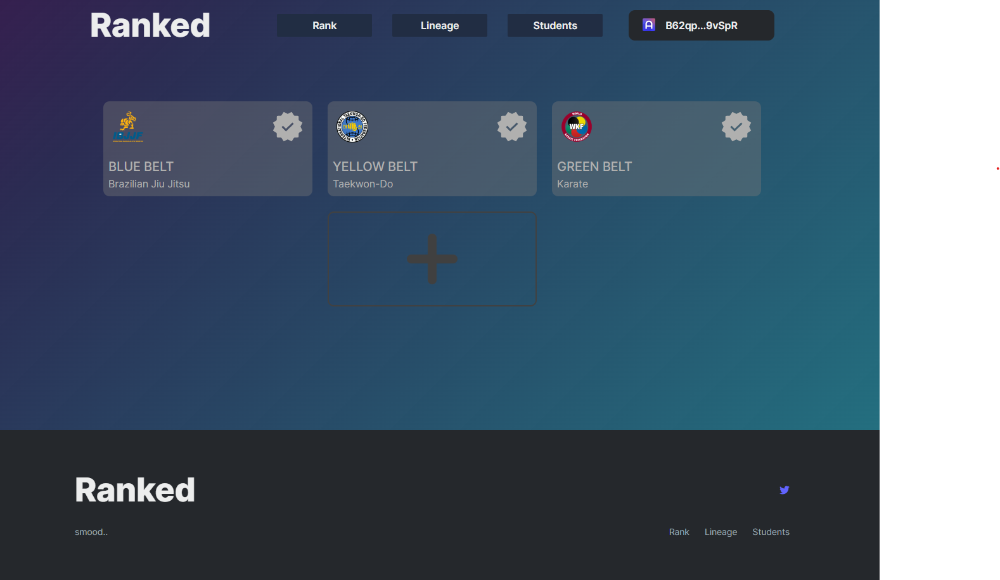
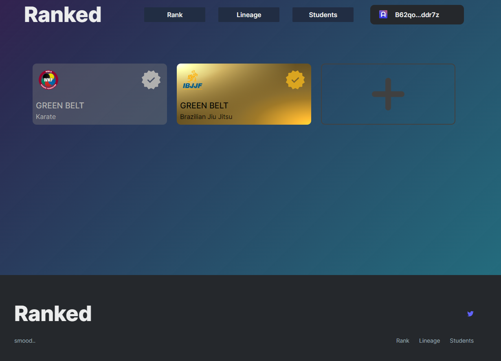
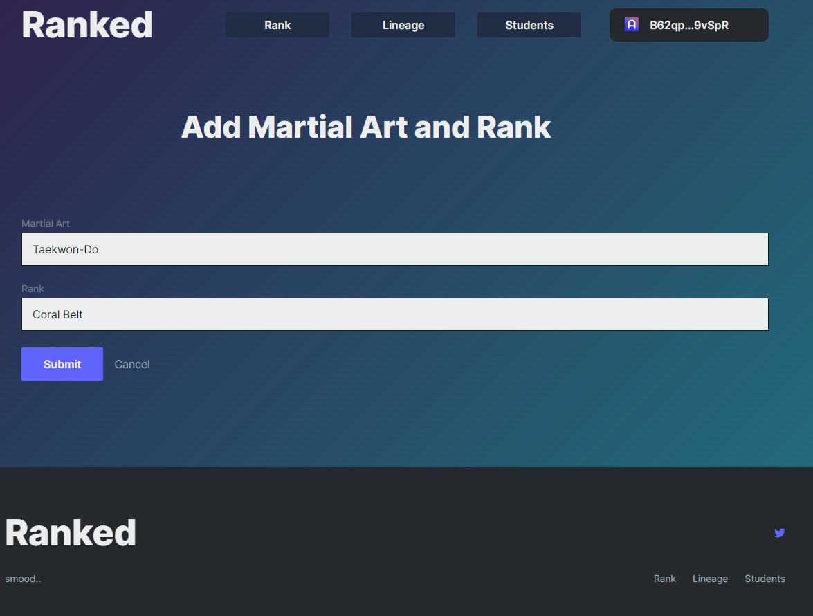

# Ranked
## Trusted Martial Arts rank promotions

Prove and share rank/belt level, promote sutdents to new a new rank or even revoke their rank built using React and SnarkyJS for the Mina blockchain.
The application has 3 main components
- Mina Smart Contract
- React JS frontend
- Firebase database

## Mina Smart Contract 
The **Ranked** application currently ustilizes a simple smart contract that is only able to store 3 certifications for 3 different martial arts. With further development this could be expanded to facilitate more users utilizing *Off-chain* storage.
The contract lets you specify an Instructor wallet on-chain that can promote a student to a specific rank via various methods.

A hash of the students rank and martial art is stored on chain. The Ranked Martial Artists' portal uses hash to verify the students claim to that rank.

## Ranked Martial Artists' portal

The portal built using React and SnarkyJS allows martrial artists supports the following at present
- Login with your Auro wallet
- Directs you to various actions if you dont have a wallet or your account setup
- Allows you to add your current ranks in various martial arts (3 ATM)
- These ranks are visible on the Rank page where you will notice they are gray indicating you have not been certified
- Allows an instructor (the address defined on chain) to promote/certify a students rank by their wallet address on the Students page
- The promotion/certification process causes a hash of the student's rank to be stored on-chain
The Rank page uses this hash to present a badge of certification for the certified martial art

### Uncertified Ranks

### Certified Ranks

### Add Rank

### Promote Student

